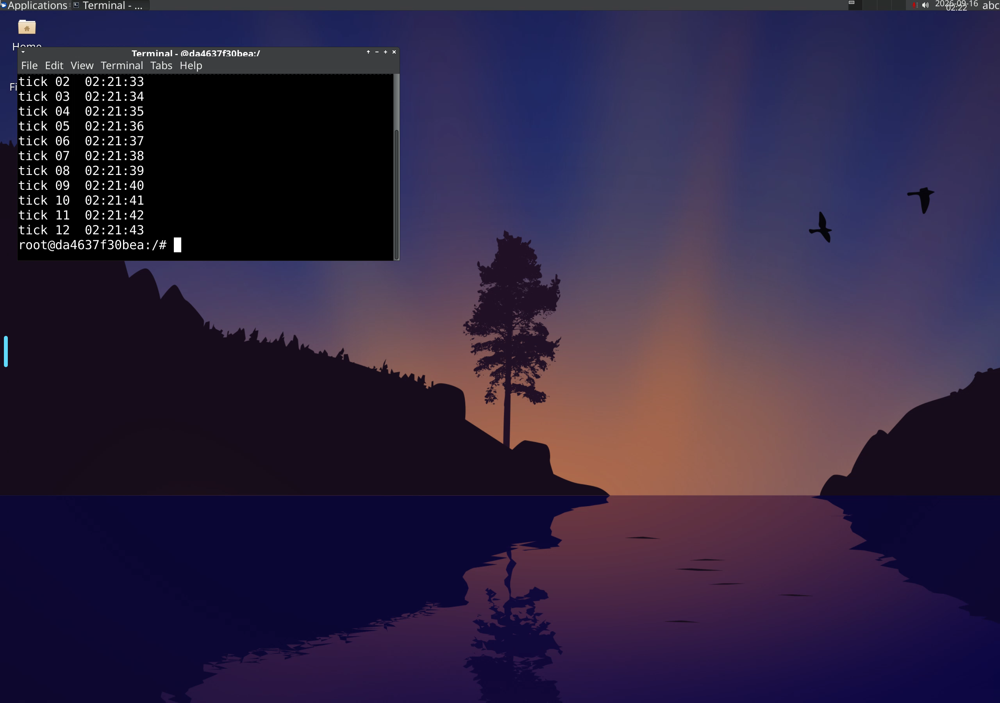
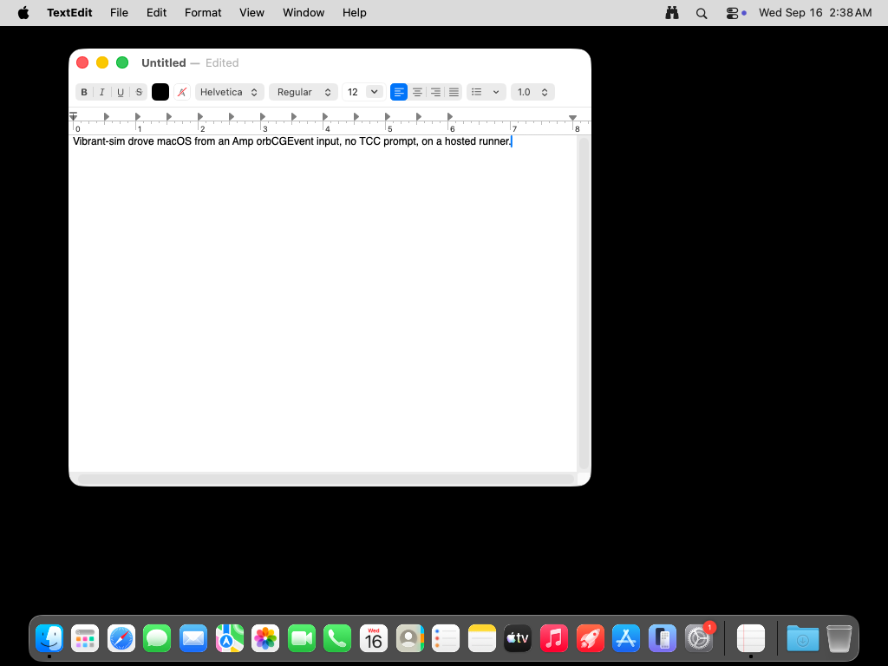

# vibrant-sim

A machine with a screen, on demand, that a person and an agent drive together.

You ask for Linux, macOS, or Windows. A GitHub Actions job brings up a real
graphical desktop, exposes it through one authenticated tunnel, and hands back
a handle. Your agent clicks, types, reads the UI, and records video. You open a
link and watch the same screen while it happens. At the end there is an evidence
package someone can sign off.

```bash
vsim session start --os linux

session   linux-2d8b65e3  (linux, expires 2026-09-16T02:47:57Z)
watch     https://product-fisher-....trycloudflare.com/__vsim/auth?k=...
agent api https://product-fisher-....trycloudflare.com/__vsim/api
```



That screenshot is a browser on one machine looking at a desktop on a GitHub
runner, while an agent on a third machine types into it through the API.

## Why

Plenty of projects let an agent drive a screen. None of them bring you the
machine. They all assume a simulator or a desktop already exists somewhere a
person is sitting. The gap is the machine itself, and the fact that a person and
an agent can never see the same one at the same time.

Two defaults follow from that:

- **Check before release.** A flow runs on a real desktop, produces evidence, and
  a person approves or rejects it.
- **Check while developing.** The agent brings up a machine mid-task, tries the
  thing, looks at it, and tears it down.

## Install

```bash
npm install -g vibrant-sim     # needs Node >= 22.18 and the gh CLI
vsim doctor
```

Copy the two workflows into the repository you want to test:

```
.github/workflows/vsim-session.yml    interactive sessions
.github/workflows/vsim-verify.yml     unattended checks with an approval gate
```

## Driving a machine

```bash
vsim shot -o screen.png     # screenshot
vsim tree                   # UI tree: element names and coordinates
vsim click 640 400
vsim type 'hello'
vsim key ctrl+s
vsim exec 'ls /tmp'
vsim record start --name demo
vsim record stop            # real video, collected as an artifact
vsim session end
```

## Checking something and getting a sign-off

A flow is a list of steps, some of which assert:

```json
{
  "name": "desktop smoke",
  "steps": [
    { "screenshot": "idle-desktop" },
    { "exec": "DISPLAY=:1 xfce4-terminal & sleep 3; echo opened" },
    { "click": [400, 300] },
    { "type": "echo acceptance-probe | tee /tmp/proof.txt" },
    { "key": "Return" },
    { "screenshot": "after-typing" },
    {
      "name": "the keystrokes really reached the GUI",
      "exec": "grep -q acceptance-probe /tmp/proof.txt && echo landed",
      "expect": { "contains": "landed" }
    }
  ]
}
```

```bash
vsim run --flow examples/smoke.flow.json --os linux
```

Out comes `vsim.result.json`, `junit.xml`, `summary.md`, and the screenshots.

`vsim.result.json` is deliberately neutral: what ran, what was seen, what was
asserted, who signed off, and what it cost. Every tool in this space invents its
own report format, so a result from one cannot be read by another.

The `vsim-verify` workflow ends in a job whose environment has required
reviewers. The run stops there until a person approves in the GitHub UI, by
email, or on their phone — **and waiting is not billed**, so holding a release
for a human costs nothing. An agent can take the same decision:

```bash
vsim approve <run-id> --note "checked the login screen renders"
```

## How the handle stays private

A job log on a public repository is world-readable. Existing prototypes print the
tunnel URL straight into it, which hands a live desktop to anyone watching.

Instead:

1. The CLI generates a one-time X25519 keypair locally and passes only the public
   key as a workflow input.
2. The runner brings up the desktop, the gateway, and the tunnel, then encrypts
   `{tunnel URL, pairing key}` to that public key and emits only ciphertext.
3. The CLI downloads the artifact and decrypts it. Nobody else can.

cloudflared's own output is discarded rather than logged, because it banners the
URL on stderr.

The desktop itself never listens on a public interface. webtop ships with no
authentication at all, and the built-in VNC servers on macOS and Windows are no
better, so the gateway in front of them requires the pairing key on every
request, including the WebSocket upgrade that carries the picture.

The session job runs with `permissions: {}` and no secrets, and only
`workflow_dispatch` can start it. Never wire this to `pull_request_target`.

## What actually works, measured

Probed on GitHub-hosted runners on 2026-09-16
([probe run](https://github.com/sol1560/vibrant-sim/actions/runs/35045793201)),
then exercised end to end from a separate machine.

| | Linux (`ubuntu-latest`) | macOS (`macos-latest`) | Windows (`windows-latest`) |
|---|---|---|---|
| machine | 4 cores / 16 GB | 3 cores / 7 GB, arm64 | 4 cores / 16 GB |
| desktop | webtop container (XFCE) | Aqua, the real login session | interactive session |
| screenshot | `import -window root` ✅ | `screencapture -x` ✅ | `CopyFromScreen` ✅ |
| synthetic input | `xdotool` ✅ | CGEvent via Swift ✅ | `SendInput` + SendKeys ✅ |
| UI tree | X11 window list ✅ | System Events ✅ | UI Automation ✅ |
| video | `ffmpeg x11grab` ✅ | `screencapture -v` ✅ | frame sequence |
| live picture in a browser | KasmVNC ✅ | built-in VNC + noVNC | TightVNC + noVNC |
| tunnel | cloudflared ✅ | cloudflared ✅ | cloudflared |

✅ means it was run and the output was inspected, not that it should work.

macOS needed no accessibility prompt: `launchctl managername` reports `Aqua`,
`screencapture` returns a real frame with the menu bar and Dock, and System
Events answers `osascript`. That contradicts the common claim that headless
macOS GUI automation on a hosted runner is unsolved.

Here is a TextEdit document on a hosted macOS runner, typed into with synthetic
CGEvent keystrokes from another machine:



Two things that only showed up by running it:

- **cloudflared prints a tunnel URL before the tunnel routes.** Waiting for the
  URL is not enough; you have to wait for a registered connection.
- **A macOS runner cannot resolve its own trycloudflare hostname.** A tunnel that
  works perfectly from outside looks dead from the inside, so the runner does not
  try to check its own tunnel.

### Known rough edges

- **Windows is implemented but not yet exercised end to end.** The primitives are
  all verified on a runner — screenshot, SendInput, UI Automation, RDP enabled,
  TightVNC listening on 5900 — but no full session has been driven through the
  tunnel yet.
- **The `acceptance` environment has no required reviewers configured here**, so
  the gate currently passes straight through. Add reviewers in
  *Settings → Environments → acceptance* to make it block. That setting cannot be
  made from a GitHub App token.
- **TextEdit autocapitalises**, so a typed `line one` arrives as `Line one`.
  Assert on structure, not on exact prose.

## What will bite you

- **A job dies at 6 hours.** That is the hard ceiling on a session.
- **macOS is the small machine**: 3 cores, 7 GB, and 10x the price per minute on
  a private repository. Public repositories are free.
- **Only 5 concurrent macOS jobs** on Free/Pro/Team. "Many macOS sessions at
  once" is not a thing.
- **macOS runners cannot nest virtualisation.** Anything that wants a VM inside a
  macOS runner will never work. Simulators are fine; they are user processes.
- **Detect capabilities at runtime.** GitHub keeps only the last three Xcode
  simulator runtimes and deletes them monthly, and an SDK being present does not
  mean its runtime is.

## Scope, on purpose

This is for testing the software in the repository it is installed in. It is not
a way to rent a desktop. It is single-tenant, sessions are short, and there is no
way to sell one to someone else — the same shape as `action-tmate`. For long or
heavy interactive work, point it at a self-hosted runner, which GitHub's terms
for Actions do not constrain the same way.

## Licence

AGPL-3.0-only.
